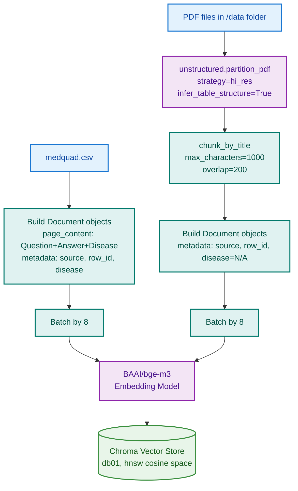
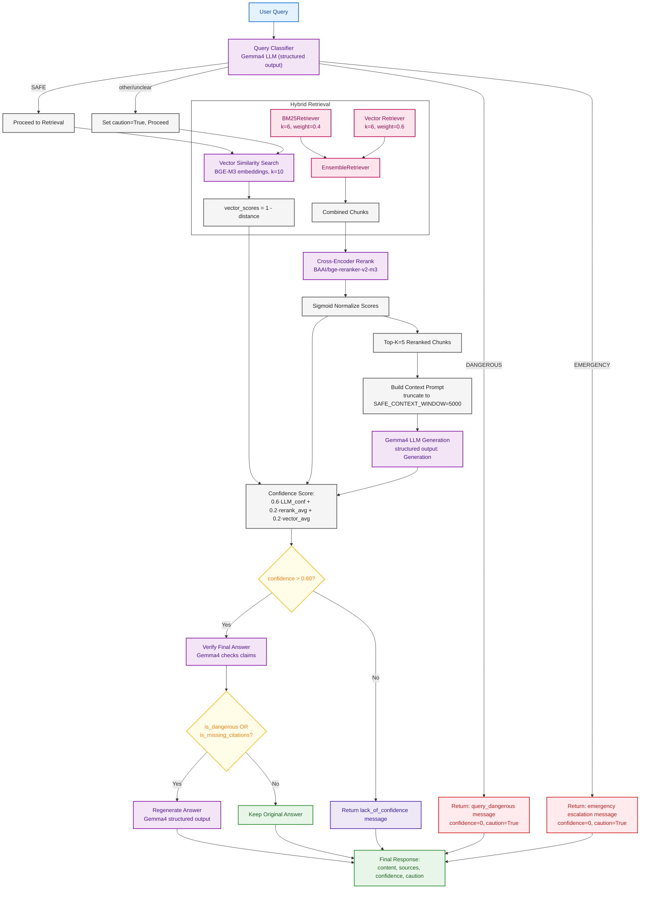

# TrustyMed Pipeline Architecture

## Ingestion Pipeline

```mermaid
flowchart TD
    A[medquad.csv]:::source --> B["Build Document objects<br/>page_content: Question+Answer+Disease<br/>metadata: source, row_id, disease"]:::process
    B --> C[Batch by 8]:::process
    C --> D["BAAI/bge-m3<br/>Embedding Model"]:::model
    D --> E[("Chroma Vector Store<br/>db01, hnsw cosine space")]:::storage

    F[PDF files in /data folder]:::source --> G["unstructured.partition_pdf<br/>strategy=hi_res<br/>infer_table_structure=True"]:::model
    G --> H["chunk_by_title<br/>max_characters=1000<br/>overlap=200"]:::process
    H --> I["Build Document objects<br/>metadata: source, row_id, disease=N/A"]:::process
    I --> J[Batch by 8]:::process
    J --> D

    classDef source fill:#e3f2fd,stroke:#1976d2,stroke-width:2px,color:#0d47a1
    classDef process fill:#e0f2f1,stroke:#00796b,stroke-width:2px,color:#004d40
    classDef model fill:#f3e5f5,stroke:#8e24aa,stroke-width:2px,color:#4a148c
    classDef storage fill:#e8f5e9,stroke:#388e3c,stroke-width:2px,color:#1b5e20
```

## Retrieval Pipeline

```mermaid
flowchart TD
    Q[User Query]:::input --> QC["Query Classifier<br/>Gemma4 LLM (structured output)"]:::llm

    QC -->|SAFE| PROCEED[Proceed to Retrieval]:::process
    QC -->|DANGEROUS| DANG["Return: query_dangerous message<br/>confidence=0, caution=True"]:::danger
    QC -->|EMERGENCY| EMER["Return: emergency escalation message<br/>confidence=0, caution=True"]:::danger
    QC -->|other/unclear| CAUTIONFLAG[Set caution=True, Proceed]:::process

    PROCEED --> VECSEARCH
    CAUTIONFLAG --> VECSEARCH

    subgraph HR[Hybrid Retrieval]
        VECSEARCH["Vector Similarity Search<br/>BGE-M3 embeddings, k=10"]:::model --> VSCORE["vector_scores = 1 - distance"]:::process
        BM25["BM25Retriever<br/>k=6, weight=0.4"]:::retrieval --> ENSEMBLE["EnsembleRetriever"]:::retrieval
        VECR["Vector Retriever<br/>k=6, weight=0.6"]:::retrieval --> ENSEMBLE
        ENSEMBLE --> CHUNKS[Combined Chunks]:::process
    end
    style HR fill:transparent,stroke:#616161,stroke-width:1.5px

    CHUNKS --> RERANK["Cross-Encoder Rerank<br/>BAAI/bge-reranker-v2-m3"]:::model
    RERANK --> SIGMOID["Sigmoid Normalize Scores"]:::process
    SIGMOID --> TOPK["Top-K=5 Reranked Chunks"]:::process

    TOPK --> PROMPT["Build Context Prompt<br/>truncate to SAFE_CONTEXT_WINDOW=5000"]:::process
    PROMPT --> GEN["Gemma4 LLM Generation<br/>structured output: Generation"]:::llm

    VSCORE --> CONF["Confidence Score:<br/>0.6·LLM_conf + 0.2·rerank_avg + 0.2·vector_avg"]:::process
    SIGMOID --> CONF
    GEN --> CONF

    CONF --> THRESH{"confidence > 0.60?"}:::decision
    THRESH -->|No| LOWCONF[Return lack_of_confidence message]:::warning
    THRESH -->|Yes| VERIFY["Verify Final Answer<br/>Gemma4 checks claims"]:::llm

    VERIFY --> CLAIMCHECK{"is_dangerous OR<br/>is_missing_citations?"}:::decision
    CLAIMCHECK -->|Yes| REGEN["Regenerate Answer<br/>Gemma4 structured output"]:::llm
    CLAIMCHECK -->|No| KEEP[Keep Original Answer]:::success

    REGEN --> RESPONSE["Final Response:<br/>content, sources, confidence, caution"]:::success
    KEEP --> RESPONSE
    LOWCONF --> RESPONSE
    DANG --> RESPONSE
    EMER --> RESPONSE

    classDef input fill:#e3f2fd,stroke:#1976d2,stroke-width:2px,color:#0d47a1
    classDef llm fill:#f3e5f5,stroke:#8e24aa,stroke-width:2px,color:#4a148c
    classDef model fill:#f3e5f5,stroke:#8e24aa,stroke-width:2px,color:#4a148c
    classDef retrieval fill:#fce4ec,stroke:#c2185b,stroke-width:2px,color:#880e4f
    classDef process fill:#f5f5f5,stroke:#616161,stroke-width:2px,color:#212121
    classDef decision fill:#fffde7,stroke:#fbc02d,stroke-width:2px,color:#f57f17
    classDef danger fill:#ffebee,stroke:#d32f2f,stroke-width:2px,color:#b71c1c
    classDef warning fill:#ede7f6,stroke:#5e35b1,stroke-width:2px,color:#311b92
    classDef success fill:#e8f5e9,stroke:#388e3c,stroke-width:2px,color:#1b5e20
```
