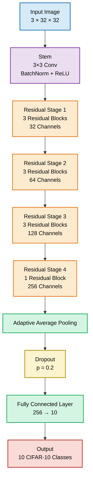
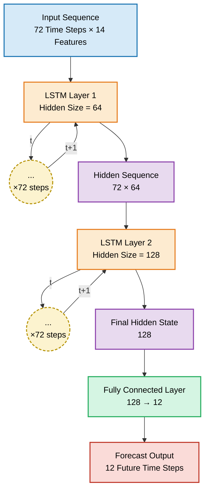

```mermaid
flowchart TD
    A["Input Sequence<br/>72 Time Steps × 14 Features"] --> B["Input Projection<br/>Linear: 14 → 128"]
    B --> C["+ Sinusoidal Positional Encoding"]
    C --> D1S

    subgraph D1["Encoder Block 1"]
        direction TB
        D1S["Multi-Head Attention<br/>4 heads × 32 dim"] --> D1A["Add + LayerNorm<br/>(residual, dropout 0.1)"]
        D1A --> D1F["Feed Forward<br/>128 → 64 → 128 (ReLU)"]
        D1F --> D1B["Add + LayerNorm<br/>(residual, dropout 0.15)"]
    end

    D1B --> D2S

    subgraph D2["Encoder Block 2"]
        direction TB
        D2S["Multi-Head Attention<br/>4 heads × 32 dim"] --> D2A["Add + LayerNorm<br/>(residual, dropout 0.1)"]
        D2A --> D2F["Feed Forward<br/>128 → 64 → 128 (ReLU)"]
        D2F --> D2B["Add + LayerNorm<br/>(residual, dropout 0.15)"]
    end

    D2B --> E["Mean Pool over Time<br/>72 × 128 → 128"]
    E --> F["Output Head<br/>Linear: 128 → 12"]
    F --> G["Forecast Output<br/>12 Future Time Steps"]

    classDef inputStyle fill:#1E293B,stroke:#0EA5E9,stroke-width:2px,color:#F1F5F9
    classDef projStyle fill:#164E63,stroke:#22D3EE,stroke-width:2px,color:#F0FDFA
    classDef attnStyle fill:#7C2D12,stroke:#FB923C,stroke-width:2px,color:#FFF7ED
    classDef ffnStyle fill:#1E1B4B,stroke:#818CF8,stroke-width:2px,color:#EEF2FF
    classDef normStyle fill:#422006,stroke:#EAB308,stroke-width:2px,color:#FEFCE8
    classDef poolStyle fill:#052E16,stroke:#4ADE80,stroke-width:2px,color:#F0FDF4
    classDef outputStyle fill:#4C0519,stroke:#FB7185,stroke-width:2px,color:#FFF1F2

    class A inputStyle
    class B projStyle
    class C normStyle
    class D1S,D2S attnStyle
    class D1F,D2F ffnStyle
    class D1A,D2A,D1B,D2B normStyle
    class E poolStyle
    class F projStyle
    class G outputStyle

    style D1 fill:none,stroke:#64748B,stroke-width:1px
    style D2 fill:none,stroke:#64748B,stroke-width:1px
```

# Spider ML Task 2 

---

This repostiory has two sub-tasks  
1. Base Task
2. Applied Task

---

# Base Task 

## Overview 
>Built custom implementations of **ResNet**, **LSTM**, and an **Encoder-Only Transformer** from scratch to understand their internal architectures without relying on pre-built implementations. Analyzed training and evaluation metrics, interpreted model performance, and documented the reasoning behind architectural design choices, hyperparameter selection, and optimization strategies.

---

# ResNet

## Overview

This project implements a custom **Residual Neural Network (ResNet)** from scratch using **PyTorch** for multi-class image classification on the **CIFAR-10** dataset. The architecture leverages **residual learning** through skip connections, enabling efficient gradient propagation and improved training of deeper convolutional networks.

The model consists of four residual stages that progressively learn hierarchical image features while increasing the feature depth. To improve generalization, the training pipeline incorporates **data augmentation**, **Batch Normalization**, **Dropout**, and the **Adam optimizer**. Performance is evaluated using accuracy, precision, recall, F1-score, and a confusion matrix, providing a comprehensive assessment of the model's classification capability across all ten CIFAR-10 classes.

## Model Architecture

## Performance Metrics

The trained ResNet model was evaluated on the **CIFAR-10** test set using standard classification metrics.

| Metric | Value |
|---------|------:|
| **Test Accuracy** | **88.39%** |
| **Macro Precision** | **88.64%** |
| **Macro Recall** | **88.39%** |
| **Macro F1-Score** | **88.38%** |
| **Weighted Precision** | **88.64%** |
| **Weighted Recall** | **88.39%** |
| **Weighted F1-Score** | **88.38%** |

### Class-wise Performance

| Class | Precision | Recall | F1-Score |
|-------|----------:|--------:|----------:|
| Airplane | 89.68% | 87.80% | 88.73% |
| Automobile | 94.49% | 94.40% | 94.45% |
| Bird | 85.10% | 85.10% | 85.10% |
| Cat | 83.75% | 73.70% | 78.40% |
| Deer | 88.44% | 87.20% | 87.81% |
| Dog | 81.23% | 87.00% | 84.02% |
| Frog | 80.03% | 96.60% | 87.54% |
| Horse | 94.39% | 89.20% | 91.72% |
| Ship | 95.20% | 89.20% | 92.10% |
| Truck | 94.08% | 93.70% | 93.89% |

### Key Observations

- Achieved an overall **test accuracy of 88.39%** on the CIFAR-10 test set.
- **Automobile**, **Truck**, **Ship**, and **Horse** achieved the highest classification performance with F1-scores above **91%**.
- The **Cat** class was the most challenging, with a recall of **73.70%**, indicating confusion with visually similar animal classes.
- The **Frog** class achieved the highest recall (**96.60%**), demonstrating strong class separability.
- The close agreement between macro and weighted averages indicates balanced performance across all ten CIFAR-10 classes.

## Design Choices

- A deeper ResNet architecture was adopted after observing that a shallower network consistently underfit the training data. Increasing the model depth enabled the network to learn more discriminative hierarchical features, resulting in improved classification performance.

- The model was trained for **75 epochs**, as the training and validation losses began to stabilize around this point. Extending training beyond this offered only marginal improvements while increasing the risk of overfitting.

- Data augmentation had a significant impact on model performance. Initially, the model achieved approximately **82% test accuracy** using only normalization. Introducing **Random Crop** and **Random Horizontal Flip** increased the accuracy to around **86%**, demonstrating the effectiveness of augmentation in improving generalization on unseen images.

- Also **Dropout** of 0.2 contributed preventing the overfitting. Experimented with various values but 0.2 was giving better results

---

# LSTM ( Long Short Term Memory) 

## Overview 

> This project implements **a Long Short-Term Memory (LSTM) network from scratch** for weather forecasting using the Jena Climate Dataset. The objective is to predict the next 12 hours of temperature from the previous 72 hours of weather observations by learning temporal patterns present in historical weather data. Instead of relying on PyTorch's built-in recurrent modules, every component of the LSTM the **input gate, forget gate, output gate, candidate cell state, cell state updates, and hidden state updates** was **implemented manually** to gain a deeper understanding of the architecture and its memory mechanism. The model was evaluated using regression metrics such as **R² Score, MAE, MSE, and Huber Loss** to assess its forecasting performance.

## Custom Architecture

## The Role of each Gate 

### Forget Gate

The Forget Gate determines how much information from the previous memory cell  (C_t−1) should be retained. It outputs values between 0 and 1 using a sigmoid activation, where 0 means completely discard the information and 1 means retain it entirely.

### Input Gate

The Input Gate governs how much of the candidate memory cell (C~t) is written into the cell state. It selectively incorporates new information from the current input and previous hidden state, allowing the LSTM to update its long-term memory.

### Candidate Memory Cell

The Candidate Memory Cell generates a set of potential new memory values using a tanh activation. These values represent new information extracted from the current input and previous hidden state, which are then filtered by the input gate before being added to the cell state.

### Output Gate

The Output Gate determines which information from the updated cell state (C_t) is exposed as the hidden state (h_t	). If it is zero we retain no information from the Cell state. It filters the cell state's information using a sigmoid gate, enabling the LSTM to produce the appropriate output while preserving long-term memory internally.

## Training Stability

The custom LSTM converged in approximately **20 epochs**. After experimenting with different optimizers, learning rates, and epochs, the following configuration produced the best balance between convergence speed and forecasting performance. Throughout training, no significant gradient instability or loss oscillations were observed, indicating stable optimization.

### Training Configuration

| Hyperparameter | Value |
|----------------|-------|
| **Optimizer** | AdamW |
| **Learning Rate** | 1e-3 |
| **Loss Function** | MSELoss |
| **Epochs** | 20 |

## Sequence Length Considerations

The model was trained using a 72-hour input sequence to forecast the next 12 hours of temperature. Selecting a shorter sequences may fail to capture long-term weather patterns, while excessively long sequences increase computational cost and can introduce redundant information. 

## Design Choices

- A single-layer LSTM did not have enough capacity to capture the temporal patterns, resulting in underfitting. Stacking **two LSTM layers** enabled the model to learn more expressive sequential representations and improved forecasting performance.

- Different hidden state dimensions were evaluated during experimentation. A hidden size of **64** for the first layer and **128** for the second layer provided a good balance between model capacity and generalization, and reduced overfitting.

- Training and validation losses plateaued after approximately **20 epochs**, with no significant improvement observed in subsequent epochs. Therefore, the model was trained for **20 epochs**, avoiding unnecessary computation and reducing the risk of overfitting.

## Model Metrics

| Metric | Value |
|--------|-------:|
| **R² Score** | **0.9553** |
| **MAE** | **0.1394** |
| **MSE** | **0.0422** |
| **Huber Loss** | **0.0210** |

---

# Transformer

## Overview

> Built an **Encoder-only Transformer** from scratch using PyTorch **without relying on predefined modules** such as `nn.Transformer` or `nn.MultiheadAttention`. Instead, each core component—including **Multi-Head Self-Attention, Positional Encoding, Feed-Forward Network, Residual Connections, and Layer Normalization** was implemented manually to gain a deeper understanding of the Transformer's architecture and internal workings. The implementation follows the architecture proposed in the paper **"Attention Is All You Need"**. The model was trained on the **Jena Climate** dataset for multi-step weather forecasting and achieved strong performance, evaluated using **R² Score, MAE, MSE, and Huber Loss**.

## Model Metrics

| Metric | Value |
|--------|------:|
| **R² Score** | **0.9564** |
| **Mean Absolute Error (MAE)** | **0.1336** |
| **Mean Squared Error (MSE)** | **0.0412** |
| **Huber Loss** | **0.0204** |

## Model Architecture 

## Design Choices 

- During the initial experiments, the Transformer showed aggressive overfitting. Introducing **Dropout** significantly improved the model's ability to generalize by _reducing reliance on specific neurons_.

- Without a learning rate scheduler, the model struggled to generalize, with the test accuracy plateauing below **88%**. Using a **learning rate scheduler** improved convergence, reduced overfitting, and led to substantially better test performance.

- Training and validation metrics showed no improvement after approximately **100 epochs**. Therefore, the model was trained for **100 epochs**.

# Applied ML - TrustyMed

## Overview
> Built an healthcare Retrieval-Augmented Generation (RAG) system that answers medical queries using evidence from trusted sources, featuring query classification, reranking, knowledge expansion, answer verification, confidence scoring, and source citations

## Features

- **Query Classification** – Categorizes user queries into **Safe**, **Dangerous**, or **Emergency** before retrieval.
- **Hybrid Retrieval** – Combines dense vector search (Chroma + BGE-M3 embeddings) with BM25 keyword retrieval using an Ensemble Retriever.
- **Knowledge Expansion** – Retrieves evidence from MedQuAD and trusted medical guideline documents (e.g., WHO, CDC, NICE).
- **Cross-Encoder Reranking** – Improves retrieval quality by reranking retrieved documents using **BAAI/bge-reranker-v2-m3**.
- **Structured Answer Generation** – Generates responses with cited sources, retrieved document IDs, and confidence estimates.
- **Answer Verification** – Validates generated responses for missing citations and potentially unsafe medical claims, regenerating answers when necessary.
- **Confidence Pipeline** – Computes a final confidence score by combining LLM self-confidence, retrieval similarity, and reranker scores.
- **Safety Guardrails** – Detects dangerous or emergency medical queries and returns appropriate safety guidance instead of unsupported medical advice.
- **Transparent Citations** – Returns evidence sources and document references alongside every generated response.

[View Model Architecture](/Applied_ML/architecture/pipeline_architecture.md)

[Read Design Choices](/base_task/report/Comparison.md)

---
